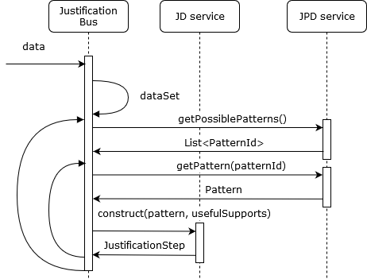

# Justification Factory :: Web Services :: Bus

## What use?

Only one route is available:

```
POST /bus/supports
Content-Type: application/json

{
  "supports": [*serialized supports...*]
}
```

This route transmit supports to the bus so that he can build Justification Diagrams based on the known Justification Pattern Diagrams.

## Warnings

The production version of the bus use a MongoDB database both for received supports and saved justification systems.

The DAO for the justification systems is described in the [jf-dao module](../../jf-dao).
It is really alike the DAO for the known supports but the environment variables to parameterize it are different:

| Parameter meaning      | Environment variable | Default value             |
|------------------------|----------------------|---------------------------|
| MongoDB location       | ksDatabaseUrl        | mongodb://localhost:27017 |
| Name of the database   | ksDatabaseName       | jf                        |
| Name of the collection | ksDatabaseCollection | knownSupports             |

Make sure that the six environment variables (three for the known supports, three for the justification systems) are correctly setup in the host of the bus service.

## What does it?

You send evidences to the bus. It checks the evidences base and compare it to the needs of the Justification Diagrams.
If there is enough evidences to build one step, it builds it, then continues.

